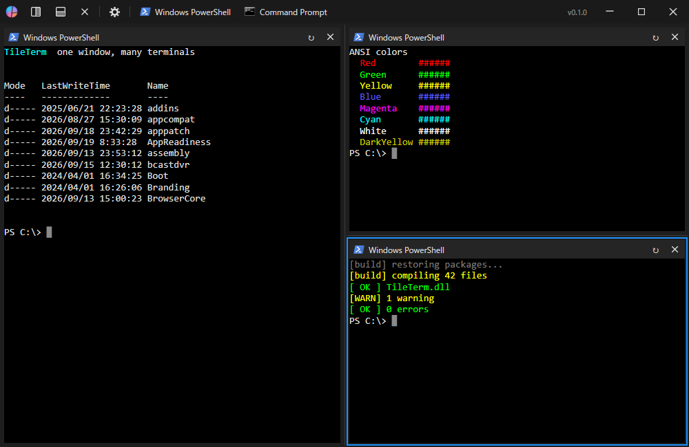
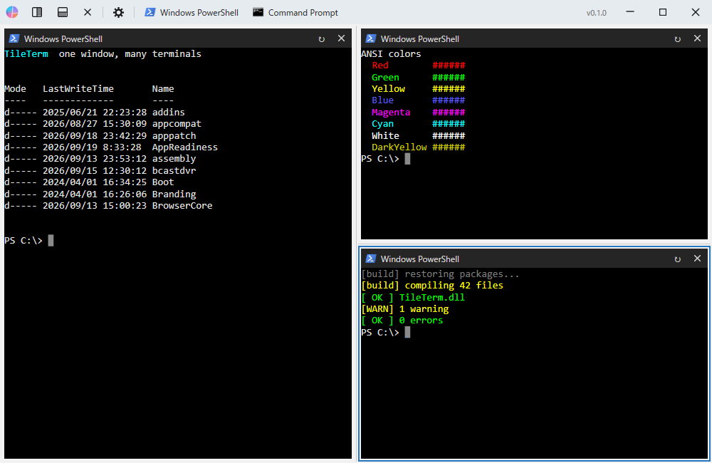
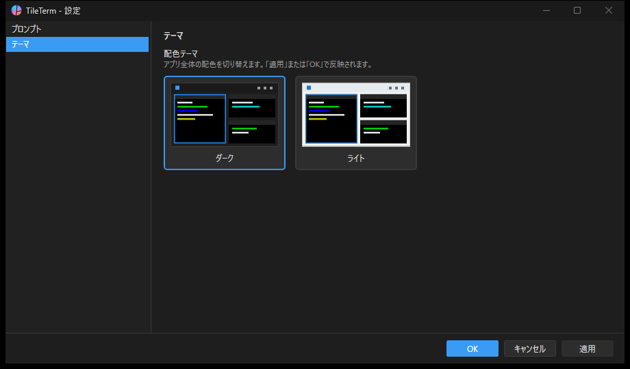

# TileTerm

A tiling terminal for Windows: split one window into as many panes as you like and run any console app in
each of them — cmd, PowerShell, Git Bash, Claude Code, and anything else that runs in a console.



> TileTerm is under active development (0.x). It is usable day to day, but features and the settings file
> format may still change.
>
> The user interface is currently **Japanese only**.

## Features

- **Free-form splitting**: split the active tile to the right or downward, as deep as you like. Closing a tile
  gives its space to its neighbor. Drag the dividers to resize.
- **Drag and dock tiles**: grab a tile's title strip and drop it onto another tile to swap places or dock it
  against an edge.
- **Any console app**: add a *profile* (executable, arguments, working directory, icon) in the settings and it
  becomes launchable in any tile. Sessions run on a real pseudo console (ConPTY), so interactive full-screen
  apps such as Claude Code render correctly.
- **Favorites bar**: pin profiles to the title bar; double-click one to open it in a side-by-side split,
  right double-click for a stacked split.
- **Japanese input (IME)**: text being composed is shown at the cursor.
- **Dark and light themes**: switch in the settings, no restart needed. The tiles themselves stay dark in
  both themes.

| Dark | Light |
|---|---|
|  |  |



## Download and install

Get one of the following from [Releases](https://github.com/syanmi/TileTerm/releases). No .NET installation is
needed.

| Kind | File | Use it when |
|---|---|---|
| Installer | `TileTerm-vX.Y.Z-win-x64-setup.exe` | You want a normal install: Start menu entry, uninstall from Windows Settings. No administrator rights are needed by default. |
| Portable | `TileTerm-vX.Y.Z-win-x64-portable.zip` | You want to run it without installing. Everything stays in the extracted folder, so deleting it leaves no trace. |

**Requirements**: 64-bit Windows 10 version 1809 (build 17763) or later.

**About the first-run warning**: the executable is not code-signed yet, so Windows may show "Windows protected
your PC". Choose *More info* → *Run anyway*. To check that a download is intact, compare it with the
`SHA256SUMS.txt` attached to each release:

```powershell
Get-FileHash .\TileTerm-vX.Y.Z-win-x64-setup.exe -Algorithm SHA256
```

### Where settings are stored

| Kind | Location |
|---|---|
| Installer | `%AppData%\TileTerm` (`profiles.json` and `settings.json`). It is kept when you uninstall, so a reinstall picks up your settings. |
| Portable | The `data` folder next to the executable. This happens because the zip contains an empty `TileTerm.portable` file; delete that file to use `%AppData%\TileTerm` instead. |

## Getting started

1. On launch, one tile opens with the default profile (Command Prompt on first run).
2. The **split right** / **split down** buttons in the title bar split the active tile using the default profile.
3. The **gear button** opens the settings: add and edit profiles, choose the default and favorite profiles, and
   switch the theme.
4. A favorite profile appears as a button in the title bar; double-click it to open that profile in a new split.

## Known limitations

- The tile layout is not saved; TileTerm starts with a single tile each time.
- Some text attributes are not rendered yet: italic, dim, strikethrough and blink (bold, underline and inverse
  are supported).
- Windows only. One window, no tabs.

## Building from source

Requires the .NET SDK 9.0 (pinned in `global.json`).

```powershell
dotnet build TileTerm.sln -c Debug
scripts\build_and_run.bat        # build and launch
```

The release packages (portable zip and installer) are built by `scripts\build_release.ps1`; the installer needs
[Inno Setup](https://jrsoftware.org/isinfo.php) 6.3 or later. The release procedure is described in the
"リリース" (Release) section of [CLAUDE.md](CLAUDE.md), which is written in Japanese.

## License

[MIT License](LICENSE). Third-party components are listed in [THIRD-PARTY-NOTICES.md](THIRD-PARTY-NOTICES.md).

## Acknowledgements

- The idea of splitting one window into many panes comes from [RLogin](https://osdn.net/projects/rlogin/).
- [Porta.Pty](https://github.com/tomlm/Porta.Pty) starts the pseudo console and
  [XTerm.NET](https://github.com/tomlm/XTerm.NET) provides the terminal emulation.
